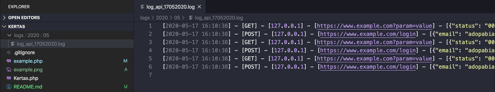

# Kertas
Sebuah perpustakaan untuk mencatat aktifitas API.

# Fitur
Dapat mencatat aktifitas API berdasarkan Folder Tahun > Folder Bulan > File Tanggal.



# Contoh Penggunaan
Clone :
```bash
$ git clone https://github.com/adopabianko/kertas.git
```

Jalankan example.php di console:
```bash
$ php example.php
```
